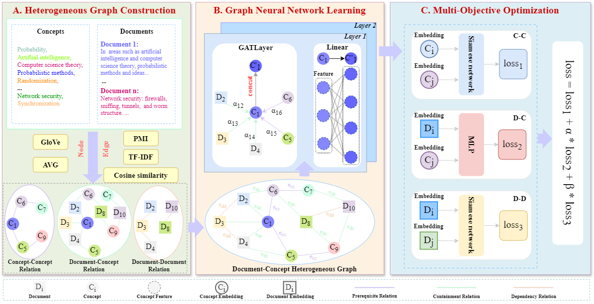

<div align="center">
  
# [AAAI 2025] Learning Concept Prerequisite Relation via Global Knowledge Relation Optimization

**GKROM** is a novel global knowledge relation optimization approach for concept prerequisite relation learning. [[doi]](https://doi.org/10.1609/aaai.v39i2.32156).

> Miao Zhang, Jiawei Wang, Kui Xiao, Shihui Wang, Yan Zhang, Hao Chen, Zhifei Li. Learning Concept Prerequisite Relation via Global Knowledge Relation Optimization. AAAI 2025 Technical Track on Cognitive Modeling & Cognitive Systems. Oral Paper.

<p>


</p>




</div>

In this paper, we introduce an innovative model designed to deeply learn concept prerequisite relations and their associated knowledge relations through a global relation optimization strategy. GKROM leverages the powerful representation learning capabilities of graph neural networks and incorporates multi-perspective information from auxiliary tasks, resulting in a more comprehensive understanding of knowledge relations. As illustrated in Figure, the architecture of GKROM outlines the entire process from heterogeneous graph construction to multi-objective optimization. The model is organized into three main layers: Heterogeneous Graph Construction, Graph Neural Network Learning, and Multi-Objective Optimization. This design allows the model to capture and understand knowledge relations from both local and global perspectives.


## Installation

Ensure you have Python 3.7+ and the required dependencies installed. 

Make sure you have the following Python packages installed:

- torch==2.1.2+cu121
- torch-cluster==1.6.3+pt21cu121
- torch-geometric==2.5.3
- torch-scatter==2.1.2+pt21cu121
- torch-sparse==0.6.18+pt21cu121
- torch-spline-conv==1.2.2+pt21cu121
- torchvision==0.16.2+cu121
- transformers==4.26.1
- tokenizers==0.13.2
- scikit-learn==1.2.0
- pandas==1.5.3
- numpy==1.24.2
- nltk==3.8.1


## Project Structure

The project is organized as follows:

```plain
│  README.md	# Project documentation (this file).
│  environment.yml	# Required Python packages.
├─data
│  │  README.md
│  ├─raw_data	# The original data files.
│  │  └─MOOC
│  │          cs_courses.csv
│  │          cs_edges.csv
│  │          cs_preq.csv  
│  ├─preprocess_data	# The preprocessed data files.
│  │  └─MOOC
│  │          concepts_index.csv
│  │          resources_index.csv
│  └─train_test_data	# The training, validation, and testing data files.
│      └─MOOC
│              depend_on_c_data_test.csv
│              depend_on_c_data_train.csv
│              depend_on_c_data_val.csv
│              depend_on_r_data_test.csv
│              depend_on_r_data_train.csv
│              depend_on_r_data_val.csv
│              r_contain_c_data_test.csv
│              r_contain_c_data_train.csv
│              r_contain_c_data_val.csv  
├─feature	# Heterogeneous Graph Construction(Need to download the GloVe model first)
│  │  README.md
│  ├─glove
│  │      glove.6B.300d.txt
│  └─MOOC
│          ccf.txt
│          cf.txt
│          dcf.txt
│          ddf.txt
│          df.txt
│          heterogeneous_graph_construction.py
└─logs
│  load_data.py	# Script for loading and preparing the data
│  utils.py	 # Utility functions
│  model.py	# Model definitions
│  train.py	# Training script
│  test.py	# Testing script
│  train.sh	# Shell script for training
│  test.sh	# Shell script for testing
│  GKROM_best_net.pth
```

## Usage

### Training

To train the model, use the train.sh script:
`bash train.sh`

This script will:

1. Load the MOOC dataset and initialize the model.
2. Train the model for a specified number of epochs.
3. Save the best model based on validation AUC.

### Testing

To test the model using a saved checkpoint, run the test.sh script:
`bash test.sh`

This script will:

1. Load the test dataset and the best model checkpoint.
2. Evaluate the model's performance on the test set.


## Parameters

Both training and testing scripts accept several command-line arguments to control the behavior of the model:

- --in_channels: Input channel size for GAT layers.
- --out_channels1: Output channel size for the first GAT layer.
- --out_channels2: Output channel size for the second GAT layer.
- --epochs: Number of epochs to train.
- --batch_size: Batch size for training and testing.
- --alpha: Loss weighting factor for the first auxiliary task.
- --beta: Loss weighting factor for the second auxiliary task.
- --lr: Learning rate for the optimizer.
- --weight_decay: Weight decay for the optimizer.
- --seed: Random seed for reproducibility.


## Logging

Both training and testing outputs are logged to timestamped files in the logs/ directory. Each log file is named based on the operation (train/test), dataset, and the time of execution.


## Citation

Please cite the following paper if you find our code helpful.

```bibtex
@article{Zhang2025gkrom, 
  title   = {Learning Concept Prerequisite Relation via Global Knowledge Relation Optimization}, 
  volume  = {39}, 
  url     = {https://ojs.aaai.org/index.php/AAAI/article/view/32156}, 
  DOI     = {10.1609/aaai.v39i2.32156}, 
  number  = {2}, 
  journal = {Proceedings of the AAAI Conference on Artificial Intelligence}, 
  author  = {Zhang, Miao and Wang, Jiawei and Xiao, Kui and Wang, Shihui and Zhang, Yan and Chen, Hao and Li, Zhifei}, 
  year    = {2025}, 
  month   = {Apr.}, 
  pages   = {1638-1646} 
}
```

